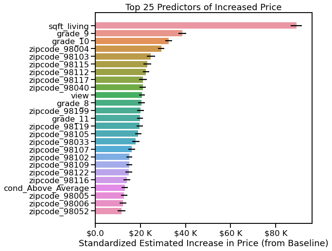

# How to Maximize Home Price
## An analysis of homes in King County, WA for Acme Real Estate Company

**Authors**: Jessica Miles

## Business problem:

Acme Real Estate Association would like to use data to understand how they can serve their customers better and increase their business. They would like to create marketing and educational material to enable their team of agents to make informed recommendations to customers about how to increase home sale prices. Although they already have plenty of experience and domain expertise, they want to confirm their intuitions and back it up with real data.

The two main questions they have are:

1. Which home features contribute most to higher sale price? Acme wants information about all factors which contribute significantly to sale price, so they can confirm their team's intuitions and educate their customers.
2. What are the most effective strategies homeowners can employ to increase the eventual sale price of their home? This should focus on features homeowners can control.


## Data:
For this project, I used home sale data where Acme is based, in King County, WA. 

 Data spans about a year between May 2, 2014 and May 27, 2015. It includes about 21,000 homes sold in most zip codes in King County, with the exception of zip codes in the heart of downtown Seattle. In order to maximize accuracy, homes sold for over \$1.12 M (considered outliers in thie data set) were removed.

I used Price as the target variable, and investigated a variety of dependent or predictor variables representing home features that homeowners can feasibly control, such as square footage, grade and condition, and number of bedrooms and bathrooms. I also investigated the impact of home features that homeowners can't control, such as zip code, environmental variables such as being  on the waterfront or having a scenic view, and the square footage of their lot. My goal was to compare the impact on Price of both variables that homeowners can and can't control, and craft actionable recommendations based on this insight.


## Methods
### Initial Scrubbing

I converted most null and dummy variables to 0, checked for and removed some duplicates, and converted columns to the appropriate data type.

I also reviewed the data dictionary I had been provided and leveraged external sources to obtain a more detailed description of grades and categories.

### Exploration

I reviewed the distributions of each variable, as well as plotted them against Price to check for a linear relationship. If I didn't see a linear relationship, I tested creating features as appropriate to see if anything appeared. 

I didn't remove outliers at first, but did note that Price was not normal.

I checked for multicollinearity and decided to exclude sqft_above. Some other variables were correlated with each other at 0.76 or so, but I left these in initially.

The following variables had a linear relationship and were kept in the initial model as continuous variables:
- sqft_living
- grade
- bedrooms
- bathrooms

The following variables were already categorical:
- zip code
- has_basement (engineered from sqft_basement)
- view
- waterfront

The following variables could be either numeric or categorical:
- floors
- condition

The following variables did not appear to have a linear relationship, and I excluded them from the initial model:
- sq ft lot
- yr renovated (and my feature years_since_reno)
- yr built

I also chose not to explore the following variables:
- date (not enough data over a long enough time period to be useful)
- lat and long
- sqft_living15 and sqft_lot15

### Iterative Modeling

All models were run on data that had been standardized to zscores so the coefficients of variables could be compared.

I made an initial model with outliers included, but it was not very accurate, and the residuals were not homoscedastic or normal, so the data did not meet the assumptions for multiple regression.

I removed outliers based on price, and re-ran the same model. It was much more accurate with an R-squared value of .818. Best of all, the residuals were fairly normal and homoscedastic, so I had a model that met the assumptions for linear regression.

I ran subsequent models testing out different variables as categorical, and also changing which categories were considered as the baseline. I balanced the most accurate R-squared with interpretability. Ultimately I chose to drop average categories for condition, grade, and zip code, to make it easier to interpret my variable coefficients.

## Results

My final model explained 82.3% of the variation in the data, which I consider to be more than adequate. Although not perfect, I believe the data meets the assumptions for a multiple linear regression, so can be used for inference to determine which variables impact price, and how their impacts compare to each other.

### Price Distribution


I removed outliers from the dataset based on price, which made the distribution much closer to normal than it had been. This shows the distribution of houses included in the final model.

### Top 10 Predictors of Increased Price


Sq. Ft Living space has the largest positive impact on price. Above average grades of 9 or 10, and location in certain zip codes have the next largest positive impacts.

## Recommendations:

### Sq. Ft. has the Largest Impact on Price


- For every sq. ft. of living space added to a home, we would expect to see an average increase in price of \$115 from the baseline
- Adding sq. ft. to a house increases price regardless of number of bedrooms
- However, adding finished sq ft to a home may not be feasible for all homeowners, and the expected cost of renovation should be considered against any estimated price increase.

### Increasing Grade level is probably the most cost effective step homeowners can take


- Grade represents quality of construction, workmanship, design, and finishes, where a Grade of 7 represents the average.
- A below average Grade score will detract from the baseline price, and an increase in each Grade level increases baseline price.
- Homeowners may find it simpler to renovate the finishings and craftsmanship of their home than it is to add sq. ft. Even an increase in a single grade level can make a difference.
- A home in above average Condition also increases price, but not as much as above average Grade.

### Considertions for Additions

- Interestingly, adding a bathroom is the only variable we analyzed that increased price without changing anything else, such as adding more square feet.
- We can interpret this by concluding that the other types of additions also require adding square feet to increase price.
- When calculating cost versus estimated price increase for additions, homeowners should consider whether they're adding enough square feet.


## Limitations & Next Steps

- Although useful for inference, our model may not be the most effective way to model housing data for prediction, and more steps would be needed to test accuracy of predictions. I did not use a train-test split of the data to test accuracy for prediction, so prediction is not appropriate.
- As next steps, I would recommend using the same model parameters but properly splitting for training and testing data to determine whether this model would be suitably accurate for predictions. 
- If a reasonably accurate model can be achieved, this would enable Acme to make better recommendations for their clients based on the characteristics of their specific home.

### For further information
Please review the narrative of our analysis in [my jupyter notebook](./index.ipynb) or review my [presentation](./SampleProjectSlides.pdf)

For any additional questions, please contact **jess.c.miles@gmail.com)

##### Repository Structure:

Here is where you would describe the structure of your repository and its contents, for exampe:

```

├── README.md               <- The top-level README for reviewers of this project.
├── index.ipynb             <- narrative documentation of analysis in jupyter notebook
├── presentation.pdf        <- pdf version of project presentation
└── images                  <- Images used in readme
└── data                    <- flat data files and column descriptions

```
